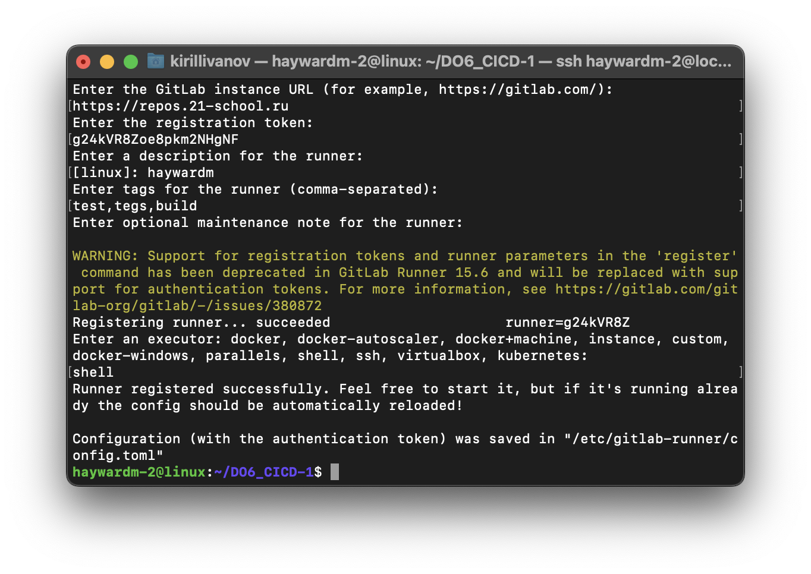

## Part 1. Настройка gitlab-runner
##### Поднять виртуальную машину Ubuntu Server 20.04 LTS

##### Скачать и установить на виртуальную машину gitlab-runner

``` brew
sudo curl -L --output /usr/local/bin/gitlab-runner "https://gitlab-runner-downloads.s3.amazonaws.com/latest/binaries/gitlab-runner-linux-amd64" 
```


``` 
curl -L https://packages.gitlab.com/install/repositories/runner/gitlab-ci-multi-runner/script.deb.sh | sudo bash
```
##### Запустить gitlab-runner и зарегистрировать его для использования в текущем проекте (DO6_CICD)
``` brew
sudo gitlab-runner start
``` 

``` 
sudo gitlab-runner register
```


Википедия:
CI/CD: что это - основы непрерывной интеграции и доставки в ...
CI/CD (Continuous Integration, Continuous Delivery — непрерывная интеграция и доставка) — это технология автоматизации тестирования и доставки новых модулей разрабатываемого проекта заинтересованным сторонам (разработчикам, аналитикам, инженерам качества, конечным пользователям и др.).
